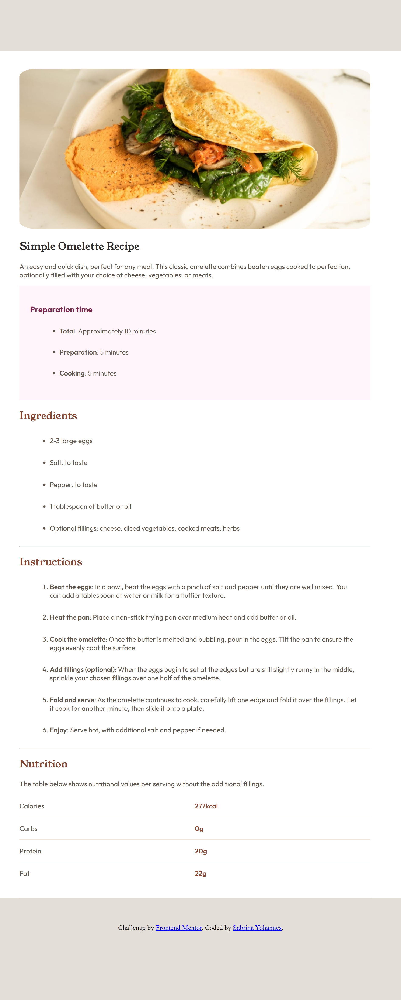

# Frontend Mentor - Recipe page solution

This is a solution to the [Recipe page challenge on Frontend Mentor](https://www.frontendmentor.io/challenges/recipe-page-KiTsR8QQKm). Frontend Mentor challenges help you improve your coding skills by building realistic projects. 

## Table of contents

- [Overview](#overview)
  - [Screenshot](#screenshot)
  - [Links](#links)
- [My process](#my-process)
  - [Built with](#built-with)
  - [What I learned](#what-i-learned)
  - [Continued development](#continued-development)
  - [Useful resources](#useful-resources)
- [Author](#author)

## Overview

### Screenshot

### Links

- Solution URL: [https://www.frontendmentor.io/profile/SabrinaY123/solutions](https://www.frontendmentor.io/profile/SabrinaY123/solutions)
- Live Site URL: [https://recipe-example.netlify.app/](https://recipe-example.netlify.app/)

## My process

### Built with

- Semantic HTML5 markup
- CSS custom properties
- CSS Grid

### What I learned

I was strugging with the Nutrition section for a little bit but then realized I could use CSS Grid -> Problem Solved!

### Continued development

I would like to practice more flex and CSS Grid. They are very useful and I am out of practice 😅

### Useful resources

- [CSS Grid Cheatsheet](https://css-tricks.com/snippets/css/complete-guide-grid/#aa-css-grid-basics) - As always you can trust css tricks 

## Author

- Frontend Mentor - [@SabrinaY123](https://www.frontendmentor.io/profile/SabrinaY123)

